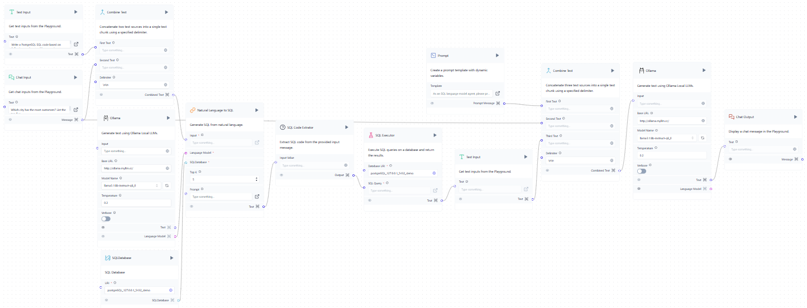

# SQL-LLM-Agent
The SQL LLM Agent is a LangFlow application that integrates SQL capabilities with a large language model (LLM), enabling users to interact with databases in a natural language format.


## Overview



_p.s. SQL Code Extractor and SQL Executor are custom components._

**The flowchart illustrates the process as follows:**\
Chat input, URI, and LLM model
→ Natural language to SQL
→ Extract the SQL code
→ Execute the SQL code
→ Combine the text (prompt and the output from database)
→ LLM model
→ Chat output


## How to Run (with Miniconda)

1. Create the environment
   ```
   conda create -n langflow python=3.11
   conda activate langflow
   ```

2. Install Langflow
   ```
   pip install langflow -U
   ```

3. Run Langflow
   ```
   langflow run
   ```

4. Load the Flow
   - Import the project’s flow JSON definition in the Langflow interface.
   - Enter the database URI (e.g., PostgreSQL).
   - Set the LLM API key (e.g., Cohere, OpenAI, or any other LLM).

## Details

- **Database Integration**: The application uses PostgreSQL as the backend database. Users need to provide a URI to connect, with the format as follows:
  ```
  postgresql://<username>:<password>@<localhost>:<port>/<database_name>
  ```

- **SQL Executor**: The application uses SQLAlchemy as the library for database connection and query execution, offering support for multiple database systems such as PostgreSQL, MySQL, SQLite, and others.

- **Natural Language Processing**: This application uses the Cohere API for natural language processing as it offers a free tier. However, you can replace Cohere with any LLM model of your choice.


For more details, see the [introduction.pdf](./doc/introduction.pdf).
