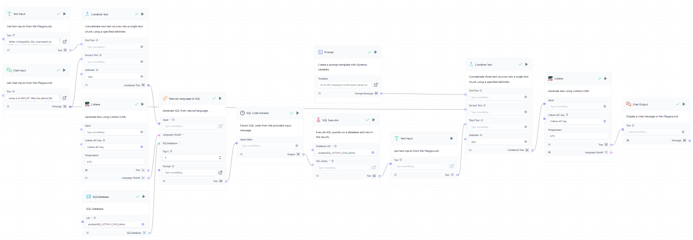

# SQL-LLM-Agent
The SQL LLM Agent is a LangFlow application that integrates SQL capabilities with a large language model (LLM), enabling users to interact with databases in a natural language format.

## Overview



_p.s. SQL Code Extractor and SQL Executor are custom components._

**The flowchart illustrates the process as follows:**
chat input, URI, and LLM model
→ natural language to SQL
→ extract the SQL code
→ execute the SQL code
→ combine the text (prompt and the output from database)
→ LLM model
→ chat output

## Details

- **Database Integration**: The application uses PostgreSQL as the backend database. Users need to provide a URI to connect, with the format as follows:
  ```
  postgresql://<username>:<password>@<localhost>:<port>/<database_name>
  ```

- **SQL Executor**: The application uses SQLAlchemy as the library for database connection and query execution, offering support for multiple database systems such as PostgreSQL, MySQL, SQLite, and others.

- **Natural Language Processing**: This application uses the Cohere API for natural language processing as it offers a free tier. However, you can replace Cohere with any LLM model of your choice.
